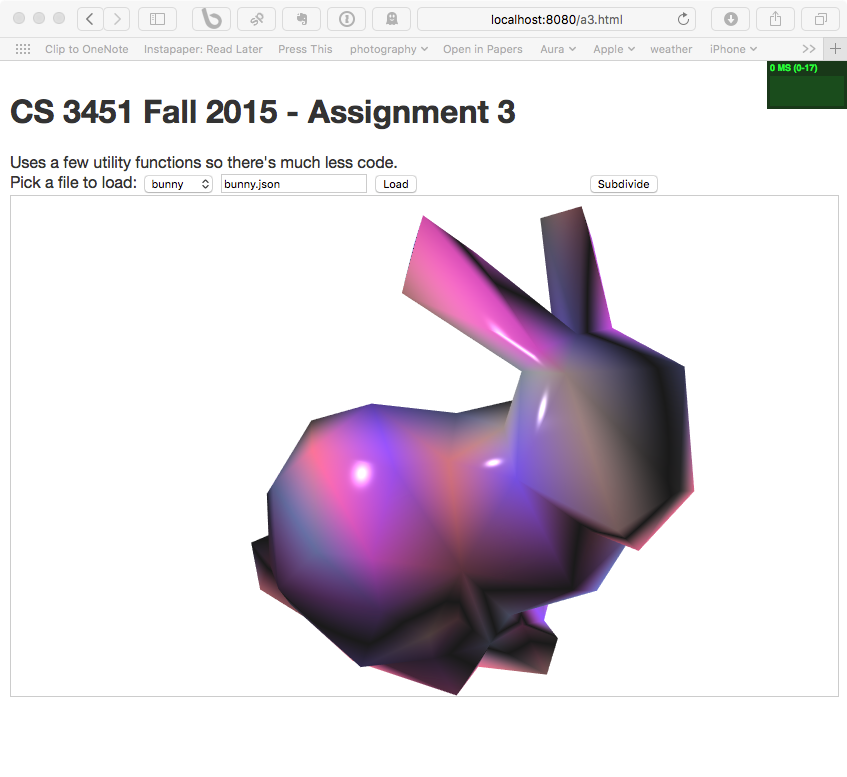
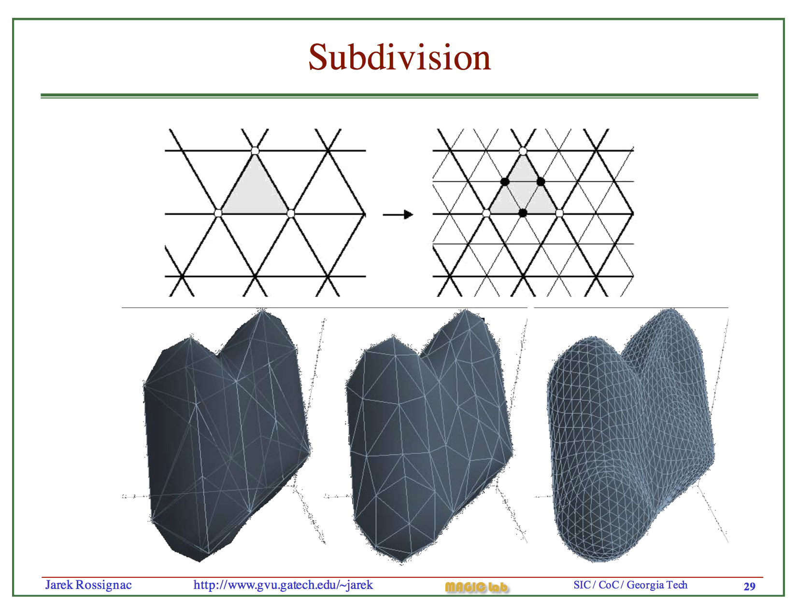
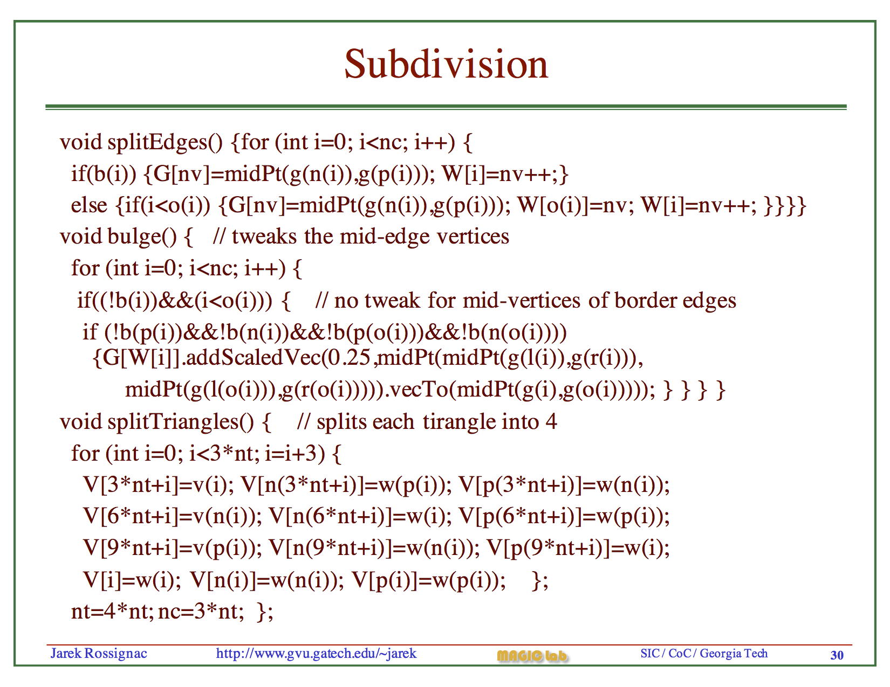

# Assignment 3: Mesh Manipulations

In this assignment, you will load, process and display mesh files.  The sample code has functionality to load and display objects, and displays a simple 3D model of the letter "F" at startup (so something is loaded and displays when you run the code, and so you can see what a model should look like when displayed).

Your task is to process the triangle mesh that is loaded from a model file in the web directory.  The files are JSON files that contain a list of vertices and triangles.  At the top of the html page is a dropdown menu for a set of models.  Selecting one will fill in the name of the json file in the models/ folder, and hitting the "Load" button will call the ```.onLoad()``` method in a3.ts.   The function is set up to use ```loader.ts``` to load and do simple validation of the JSON file (so that you can assume the vertex array contains arrays of three numbers for each vertex, and the triangle array contains arrays of three numbers for each triangle.)

I have tried to make the sample program as complete as possible (regarding the rendering components) so that you can focus on mesh manipulation.

## Due: Friday Oct 23rd, 5pm

## Overview 

The assignment requires you to do two things:
1. process the vertex/triangle data so it can be displayed properly
2. subdivide the surface into a smoother surface when the user clicks a button (a mesh could be subdivided repeatedly)

To display a model, you need to
1. convert the model arrays returned by the loader into a format suitable for rendering with WebGL
2. build the vertex corner/opposite tables as discussed in class and in Jarek's notes, and implement the corner table functions
3. use the corner table to compute a vertex normal for each vertex, based on the surface normals of the triangles that use it   
4. create a random color for each vertex so that the structure of the mesh is obvious

You should submit the full project, as in the previous assignments.  You can probably implement the whole assignment wihtout adding any more .ts files, but if you add any files, the tsconfig.json should be updated to include them; the TAs should be able to compile your files by running the ```tsc``` command and/or running ```gulp build```.

## IMPORTANT: you must use "gulp" 

Because the sample program loads data from a webserver using HTTP requests (see below), you cannot run the sample program by opening it directly.  You must either copy all the data to a web server, or using the gulp command (with the provided gulpfile.js) to run a node server directly.

We have set up the gulpfile so that if you modify any of the .ts files, it will rebuild them using your tsconfig.json file and make them available to it's web server. Therefore, you can run ```gulp watch``` from the command line to build your files and serve them up at ```http://localhost:8080/a3.html```.

## Files included in the project

The sample program (a3.html and a3.ts) are detailed and relatively complex.  You should take time to make sure you understand them before diving into the assignment.  The parts of the same project include:
- ```tsd.json```, ```tsconfig.json```, ```gulpfile.js``` and ```package.json```: the various config files from the previous assignments, used by tsd, tsc, gulp and npm respectively.
- ```a3.ts``` and ```a3.html```:  the HTML and main typescript files for the project.
- ```loader.ts```: a utility library that can fetch arbitrary files from the web, and fetch and process the JSON model files used by this assignment.  The file loading mechanism is also used to download the vertex and fragment shaders.
- ```f3d.ts```: a utilty library for creating the WebGL data for the 3D "F" model
- ```includes/style.css```: a minimal css file for the project
- ```textureUtils.ts```: a utility for generating textures (included "for interest").
- ```shaders/```: the directory containing the shaders.  ```a3-shader.*``` are used in this assignment, ```a3-shader-texture.*``` includes texture mapping functionality (included "for interest").
- ```models/```: the models for the assignment
- ```resources/```: various resources from the web, used by the project.  ```chroma.js``` and ```gl-matrix.js``` are powerful and popular open source libraries for dealing with color and matrix/vector operations. ```Stats.js``` is a small WebGL performance monitor.   (the are ```.d.ts``` files for all 3 of these included in the tsd.json (which will bein the ```typings``` directory after you run ```tsd install```).
- ```localTypings```: a relatively minimal ```.d.ts``` file for the ```webgl-utils.js``` library that I wrote (should probably be a lot more detailed, but the various utility functions take complex parameters that would be very complicated to account for).

## Models

The model files are a simple JSON object file with three fields: 
- metadata: a simple object with one element, the property ```type``` that should be set to the string ```"triangles"```.  This is used for a simple first check to see if they file is one we are expecting.
- v: an array of vertices.  Each vertex is an array of 3 numbers (3D coordinates).
- t: an array of triangles.  Each triangle is an array of 3 numbers (indices into the vertex list). The triangle vertices are specified in counter-clockwise order.

The loader does some simple validation of the model structure (i.e., verifies the "t" and "v" fields exist, and that they are arrays of arrays of 3 numbers.

## An overview of the Sample Program structure

### High level structure: asynchronous architecture

As part of this assignment, I wanted you to work with a web application that pulls data it needs from the web server. All non-trivial modern web applications pull their content from servers as part of their initialization, and are structured to load as fast as possible.  Creating a program this way requires the program to load it's assets asynchronously, so that the interface appears as soon as it can.  This application demonstrates this in three ways.

First, like most of our pervious examples, we use require.js to laod the main .js file (js/a3.js, the Javascript generated from our a3. ts file).  The AMD module system that typescript has been configured to generate code for (in it's tsconfig.json file) dynamically loads the dependencies for a3.js (loader.js and f3d.js).  It could be configured to load it's other dependencies (webgl-utils.js, gl-matrix.js, chroma.js and Stats.js), but for simplicity, I loaded them directly in the html file using ```<script>``` tags.  Loading files using synchronous script tags forces them to load immediately, before the rest of the HTML file loads.  This simplifies the application (because it knows the file has loaded) but increases the amount of time it takes for the HTML page to first render (because it must wait until all scripts have been loaded).  The same goes for `````` and ```<link>``` tags and other content. Making ```<scripts>``` asynchronous decreases the load time, but adds complexity (because you do not know which finishes first).  Loading systems like require.js combine asynchronous loading with strong dependency management, so scripts don't load until the scripts they depend on have loaded.

Second, in a3.ts we load our WebGL shader files from the web, rather than embedding them in the HTML page (as many simple WebGL examples do).  Embedding the files in the HTML page is simple, but as your shaders increase in complexity and number, this becomes impractical;  it also makes version control systems like git less useful.  To load these file from the web server, we break our program's main code into two parts.  First, we run the ```initWebGL()``` function, which initializes WebGL and then uses functions in ```loader.ts``` to make download requests for the two shader files.  The ```loader.loadFiles()``` function takes a callback that should be executed when the files have been loaded and a second to be executed if there is a failure. This pattern is often refered to as a "promise" and is common in Javascript programming.  In our case, the contents of the two downloaded files are passed to the success callback as an array called ```shaderText```.  We pass our WebGL handle ```gl``` and this array ```shaderText``` to the second half of our program code, in the ```main()``` function.  That function, in turn calls a nested ```drawScene()``` function with ```requestAnimationFrame()```, kicking off the rendering loop.

Finally, when the ```Load``` button is pressed, the ```window.loadModel()``` function is executed.  It uses a similar programming style to download the requested mesh, this time using ```loaders.loadMesh()``` which takes three callback functions:  onLoad (if successful), onError (if not) and onProgress (called during download to update you on the progress of the download).  You will receive the ```mesh``` object from the JSON load in the ```onLoad()``` method.  You should process it there, and then attach the new object you want rendered to the ```newObject``` global variable;  the ```drawScene()``` callback will swap in that object the next time it renders, and assign it to the ```object``` global variable.

Both ```loader``` functions use the web standard library ```XMLHttpRequest()```.  This library is used to issue and manage asynchronous HTTP requests in HTML5/Javascript programs. 

### Interaction

The program uses similar callbacks to the first assignment, to allow the model to be rotated around the X and Y axes. Pay careful attention to the code in the ```if (mouseAngles[0] !== 0 || mouseAngles[1] !== 0) {``` block in the ```drawScene()``` function.  This code handles is set up to do what most users expect: rotate the model related to their view of the model, which at any point in time is in world coordinates (to do this, the rotations must take into account the current rotation, not just add new rotations onto the end).

### WebGL structure

This sample uses WebGL's ```gl.drawElements()``` to render a set of triangles specified in an ELEMENT_ARRAY_BUFFER. The data for the rendering (the vertex positions, colors, normals and any other data that might be needed by more complex applications) are stored in data buffers and attached to the variables (attributes) in the shader program. The ELEMENT_ARRAY_BUFFER is a set of indices for the triangles: every three numbers are used by WebGL as the indicies into the other buffers as the corners of a triangle.   The vertex shader is called once for each vertex, and the corresponding attribute data is set to the attribute values (in our shader, the values ```a_position```, ```a_normal``` and ```a_color```.  

The shader takes other data in it's "uniform" variables.  In the vertex shader, these are:
```
uniform mat4 u_worldViewProjection;
uniform vec3 u_lightWorldPos;
uniform mat4 u_world;
uniform mat4 u_viewInverse;
uniform mat4 u_worldInverseTranspose;
```
and in the fragment shader they are:
```
uniform vec4 u_lightColor;
uniform vec4 u_colorMult;
uniform vec4 u_specular;
uniform float u_shininess;
uniform float u_specularFactor;
uniform vec4 u_ambient;
```

Finally, data is passed from the vertex to the fragment shader in "varying" parameters.  If you recall, the rasterizer interpolates data between the vertices, and we can specify as many interpolation variables as we want.  In our example, we specify:
```
varying vec4 v_position;
varying vec3 v_normal;
varying vec3 v_surfaceToLight;
varying vec3 v_surfaceToView;
varying vec4 v_color;
```
These values are used to compute a simple lighting model (diffuse and specular color for one light) independently for each pixel rasterized.

### WebGL buffers

For the object you need to create and fill in four WebGL buffers (position, normal, color and indices).  The program does this by first creating data arrays for each.  You should notice the following things about those arrays:
- if you look in f3dts, you will see they are typed arrays (Float32Array, Uint8Array, and Uint16Array).  Typed arrays are efficient arrays that (unlike other Javascript/Typescript arrays) all contain the exact same type of data.  They are actually a direct view onto an underlying array (e.g., a Float32Array with 4 elements is 16 bytes of data, not 4 number objects represented as a list of pointers, as a normal Javascript array would be).
- the types matter!  Make sure you use the right types.
- the position, normal and color buffers all have the same number of entries:  this color and normal values are specified *per vertex*.  The indices array is a different length, but it's entries point at the elements of those other buffers.

## Assignment Details

The assignment requires you to do two things: rendering and subdivision.

### Rendering
The mesh loader returns an object with two properties, "t" and "v".  You will need to generate an "object" to be used by the ```drawScene()``` function to render the object.  The structure of the object is:
```
newObject = {
    boundingBox: [vec3, vec3], // the bounding box (min x,y,z  and max x,y,z)
    scaleFactor: number,  // a scale factor so the diagonal of the bounding box gets scaled to 300 units 
    center: [number,number,number], // center of the model
    numElements: number,  // number of indices, 3 * the number of triangles
    arrays: {
      position: Float32Array,
      normal: new Float32Array,
      color:  Uint8Array,
      indices: Uint16Array
    }
  };
```
The position and indices can be taken from the loaded mesh object (but must be flattened to one array).  You should generate a set of reasonable random colors (in my testing, I used the function ```chroma.hsv(rand(360), 0.5, 1);``` to generate a random color, for example).

The most difficult part here will be to generate the correct normal for each vertex.  In Jark's notes on mesh data structures ([15Na.pdf](https://github.gatech.edu/pages/cs3451f15/files/15Na.pdf) and [15Nb.pdf](https://github.gatech.edu/pages/cs3451f15/files/15Nb.pdf)) he explains how to create the mesh corner/opposite tables, and (on page 17 of 15Nb.pdf) how to compute the vertex normal for a corner.  You need to take care to only compute the normal ones for each vertex (and, if you want to be optimal, to only compute the normal ones for each triangle).

If the data structure is set up correctly, you should see an object that looks like this (this is for the bunny model):



You should note a few things about this image.  First, the colors are blended across the surface;  this allows you to see the structure, but not the individual polygons.  You can, however, see the polygon structure on the edge of the object.  Second, the lighting in the shader allows us to see the structure more clearly, because of the surface color is brightest when facing the light, and fades to black as it faces away from the light (giving a simple appearance of "shadows").  Similarly, the use of a specular highlight will allow you to know if your surface normals are pointing out of the object (rather than into the object): if the surface normals point into the object (i.e., are backwards) there won't be any specular hightlights (why?).

### Subdivision
The most challenging part of the assignment is subdivision.  The subdivision algorithm is illustrated in these two slides from Jarek's [meshprocessing](https://github.gatech.edu/pages/cs3451f15/files/meshProcessing.ppt.pdf) slides:





The first slide shows the effect of the algorithm on a mesh:  each triangle is divided into 4, and the new points are shifted away from the old surface to smooth it out based on local geometry (the ```bulge()``` step in the algorithm).

The second slide shows the entire algorithm, which takes place in 3 steps (```splitEdges()```, ```bugle()``` and ```splitTriangles()```).   You should rewrite this by hand (using more space and proper formatting!) to make sure you understand it.  The algorithm is based entirely on the corner data structures we have been using, with a few additions:
- ```nc``` and ```nv``` are the number of corners and vertices
- ```G``` is the geometry table, ```V``` is the vertex table, and they are expanded as needed by the algorithm
- ```W``` is a new array to store the new vertex indices, and ```w()``` is the accessor for it (akin to ```v()```)
- ```vector.addScaledVec(scale, vector2)``` adds a scaled vector2 to vector
- ```midPt(v1, v2)``` computes the midpoint between v1 and v2
- ```vector.vecTo(vector2)``` computes a vector from vector to vector2

Pay careful attention to the details and make sure you understand what the algorithm is doing.  (Hint: the tests ```i<o(i)``` ensure that some operations are only done once on an edge, for one of the corners it is the "opposite of").

When the user hits the ```Subdivide``` button, you should generate a new "object" based on the current object.  This new object will have 4 times as many triangles as the first one.

## Submission

Your grade will be based on satisfying the requirements described above.  You should submit your entire code directory (WITHOUT the ```node_modules``` or ```typings``` directories generated by npm and tsd) in a clean zip file, as in the first three assignments.

**Use the file names we have requested.** (a3.html, a3.ts).  The TAs need to be able to test your program as follows:

1. cd into the directory and run ```npm install``` and ```tsd install```
2. compile and start the server with ```gulp watch```
3. open and view the web page ```localhost:8080/a3.html```

The TAs will at least test your code against the provided models, and will also look at the code to check your implementation of the mesh processing functions (the corner/opposite tables and related functions) that should be used to generate the subdivision algorithm.

## My Result

